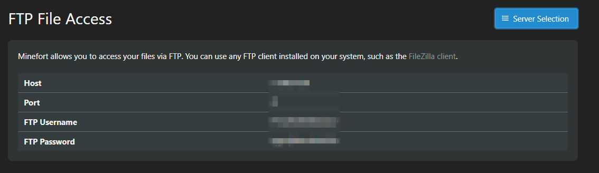

# Connect FTP

## OVERVIEW

This tutorial will walk you through the process of using an FTP client to upload files to your Minefort server.

## EXPLAINED

* Head over to your [server dashboard](https://minefort.com), you'll need to log in to do this.
* Click the  `FTP File Access` tab on the left hand side of the panel. You should see this._._\_\_
* Now we need to install **Filezilla**, which is one of the most used FTP clients out there. You can find the download link [here](https://filezilla-project.org/download.php?platform=win64).
* Once you're in Filezilla, at the top you should see an input box that contains `Host:`, `Username:`, `Password:`, and `Port:`. This is where we enter in the details from before. 
* Once you've entered in your details, click `Quickconnect`. A few warnings may come up, just click `Ok` and accept them.

You now have access to your servers files.


**Do not share** your FTP details with anybody. If you do, they could delete your entire server.



Prefer a video tutorial? [Here ](https://www.youtube.com/watch?v=g57-J2grjTo)you go!


