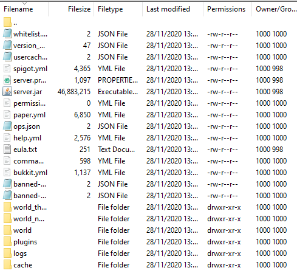

# Install Plugins

## OVERVIEW

Unlike any other server host, Minefort allows you to **upload custom plugins**.

## EXPLAINED


We need to use an **FTP** client. If you are unsure how to do this, we have a separate tutorial [here](ftp.md).


* Once you've logged into your server's FTP, you'll see a bunch of files and folders. At first this may seem worrying, but it's simple.

* We want to navigate to the **plugins** folder, which will be at the bottom. Enter the folder.
* There won't be any plugins there unless you've already uploaded some, or installed some using the **Plugins** tab on the panel.
* We now need to **download** the plugin we want. In this tutorial, we will be installing **Essentials**. Go to the plugin's download page _\(normally on SpigotMC\)_, and click `Download Now`.
* Now go back to the FTP client, and drag the `.jar` plugin file into the Plugins folder that we should have already entered. This may take a moment.
* In order for the plugins to be installed, you must **Reload** the server. Click the `Stop` button then `Start` it again.

Once the server starts, the plugins should be installed!


**Be careful!** Only install safe plugins onto the server.



Prefer a video tutorial? [Here ](https://youtu.be/UNFvKxfWGrY)you go!


